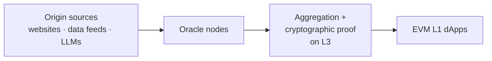
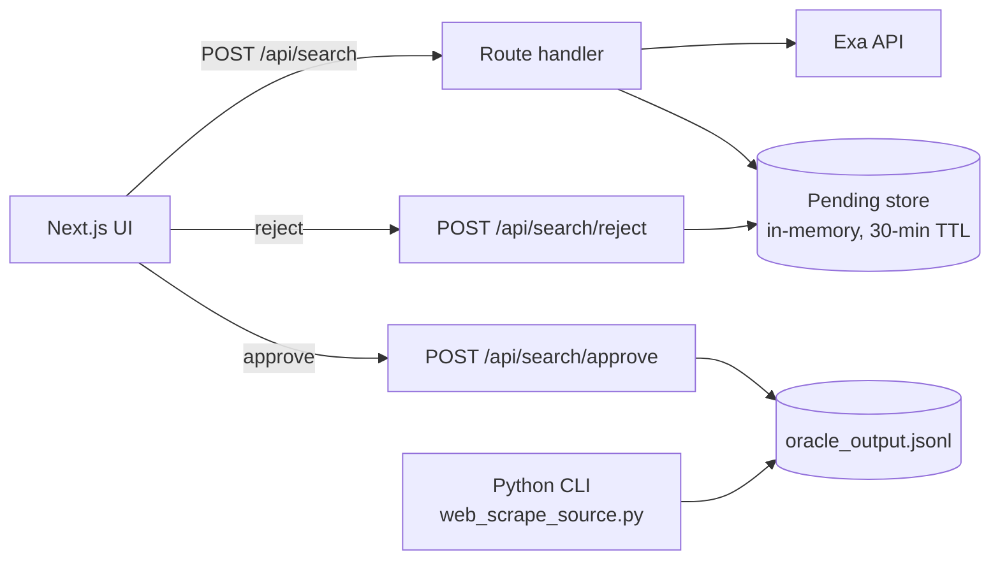

# Exa Oracle PoC — Human-in-the-Loop Web Data Source

A proof of concept for using **Exa Search** as a website data source for a decentralised blockchain oracle. It fetches structured, source-grounded datapoints, stages each one for **human approve/reject**, and appends only approved results to a shared JSONL log.

Built agentically with **Claude Code**, driven by a written spec (`CLAUDE.md`).

## Status

- First-iteration PoC, built September 2026.
- **Next (planned):** second-iteration PoC (`exa-oracle-swarm/`) to automate the oracle data-factory workflow with agentic orchestration, using [division.sh Swarm](https://github.com/division-sh/swarm).

## Context

This PoC is one building block of a wider concept: a decentralised oracle network on an **Arbitrum Orbit L3**.



This repo tests the first box for one source type. The question it answers is whether a search API can return datapoints that are **structured, attributable to a source, and reviewable** before they enter an oracle pipeline.

## What it does

- Fetches datapoints from Exa (examples: a US Open result, a Copernicus climate bulletin).
- Returns each datapoint with its **grounding**, meaning the source URL and evidence.
- Stages the result server-side for review, writing nothing to disk yet.
- On **approve**, it appends the result to `oracle_output.jsonl`. On **reject**, it discards it.

## Architecture



- **Frontend:** Next.js (App Router), TypeScript, Tailwind v4.
- **Backend CLI:** Python. This was the original fetcher, and it writes directly with no review step.
- **Shared record shape:** `{source, fetched_at, datapoint, grounding}`. Both paths write the same format.
- **Security:** the Exa API key stays server-side. It is only called from route handlers, never from the browser.

## Design decisions

| Decision | Rationale |
|---|---|
| Human approve/reject gate | Oracle data must be trustworthy, so nothing is persisted without review. |
| Grounding stored with each datapoint | Gives an audit trail back to the origin source, a precondition for later proof or attestation. |
| Append-only JSONL log | Simple, inspectable, and mirrors an event-log pattern. |
| Route Handlers, not Server Actions | Keeps one consistent pattern for the approve/reject flow. |

## Built with Claude Code

- `CLAUDE.md` is the project spec and agent instructions: commands, code style, and architecture constraints.
- `exa-integration-prompt.md` is the prompt used to drive the Exa integration.
- Tests come in two suites: pytest for the Python CLI, and Vitest for `lib/` and the API route handlers.

## Running it

You need an [Exa](https://exa.ai) API key. Copy `.env.example` to `.env` (for Python) and `web/.env.example` to `web/.env.local` (for the UI), then set `EXA_API_KEY`.

```bash
# Python CLI + tests
pip install -r requirements.txt -r requirements-dev.txt
python3 web_scrape_source.py
python3 -m pytest

# Web UI (localhost:3000)
cd web && npm install && npm run dev
npm test
```

## Known limitations

- The pending store is in-memory and single-process. It won't survive serverless or multi-instance deployment.
- There is no aggregation, consensus or on-chain proof yet. Those belong to the wider L3 design.
- The two example datapoints are hand-picked. Datapoint selection is not generalised.
